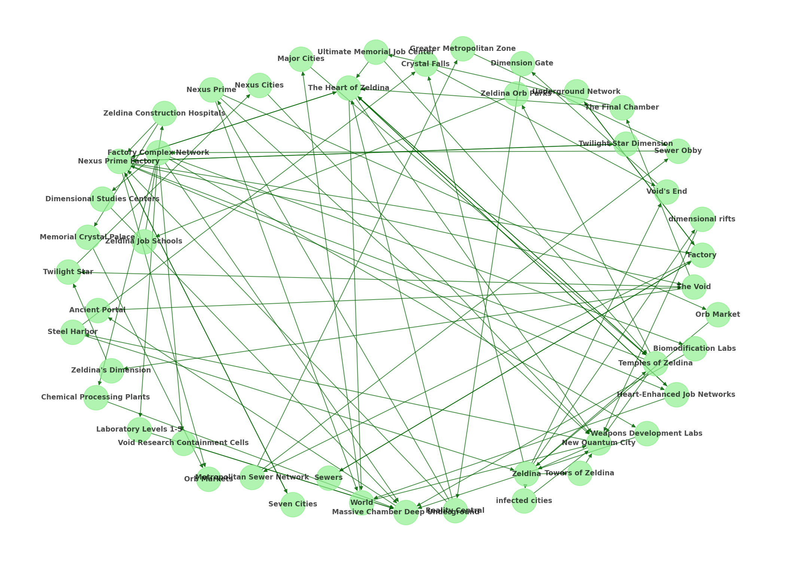

# narrative-analysis

A robust, production-ready pipeline for mapping large narratives with 100% coverage guarantee and professional-grade LLM analysis. This system ensures every atomic unit of your story is captured, analyzed, and cross-referenced using state-of-the-art language models.

## 🎉 Features

- **🚀 Real LLM Analysis**: Uses Ollama (Qwen2.5:72b) for accurate character/location extraction
- **✅ Zero-Loss Guarantee**: Every sentence tracked by UID with automatic omission detection
- **📊 Interactive Visualizations**: PNG network maps + GraphML exports for Gephi/Cytoscape
- **🔍 Automatic Gap Detection**: Built-in integrity checking and missing content detection
- **🤖 CI Integration**: GitHub Actions workflow for automatic regeneration
- **📋 Multiple Output Formats**: Markdown, CSV, and JSON outputs
- **🗺️ Derived Views**: Character atlas, location gazetteer, item inventory, and narrative flow
- **🔗 Cross-Referenced Analysis**: Character interactions and location connections

## 📸 Example Visualizations

### Character Network Analysis

*Comprehensive character relationship mapping showing 24 interconnected characters from a science fiction narrative*

### Location Flow Mapping

*Multi-dimensional location connections across 46 unique locations spanning different realities*

## Quick Start

```bash
# Clone the repository
git clone https://github.com/toddllm/narrative-analysis.git
cd narrative-analysis

# Install dependencies
pip install -r src/requirements.txt
pip install ollama

# Install Ollama and download model
curl -fsSL https://ollama.com/install.sh | sh
ollama pull qwen2.5:72b

# Run analysis on sample story
cd src
python orchestrator.py --story ../examples/sample_story.txt

# Generate visualizations
python post_processor.py

# Verify integrity
python gap_detector.py
```

## Directory Structure

```
narrative-analysis/
├── src/                    # Core pipeline code
│   ├── orchestrator.py     # Main pipeline coordinator
│   ├── ingest.py          # Story fragmentation
│   ├── post_processor.py   # Analysis & visualizations
│   ├── gap_detector.py     # Integrity verification
│   ├── verifier.py        # Quality assurance
│   ├── merge_chunks.py     # Result aggregation
│   ├── chunk_dispatcher.py # Batch management
│   └── requirements.txt    # Python dependencies
├── examples/               # Sample stories and outputs
│   ├── sample_story.txt    # Example narrative
│   └── zombie-story-analysis/  # Complete analysis example
│       ├── character_network.png
│       ├── location_flow.png
│       └── mapping.md
├── docs/                  # Documentation
└── .github/workflows/     # CI/CD automation
```

## Usage

### 1. Prepare Your Story
Place your narrative text file anywhere accessible. The pipeline will automatically:
- Fragment into chapters, paragraphs, and sentences
- Assign unique identifiers (UIDs) to each unit
- Create deterministic processing batches

### 2. Run Analysis
```bash
cd src
python orchestrator.py --story path/to/your/story.txt
```

### 3. Generate Visualizations
```bash
python post_processor.py
```

### 4. Verify Results
```bash
python gap_detector.py
```

## Output Files

The pipeline generates comprehensive analysis in multiple formats:

- **`mapping.md`** - Human-readable analysis with embedded visualizations
- **`mapping.csv`** - Spreadsheet-compatible data
- **`mapping.json`** - Structured data for further processing
- **`derived_views/`** - Character atlases, location maps, network graphs
- **`assets/`** - Visualization files (PNG, GraphML)

## LLM Integration

Uses **Ollama** with **Qwen2.5:72b** for professional-grade analysis:

```bash
# Use different model
python orchestrator.py --model qwen2.5:32b

# Fall back to mock LLM for testing
python orchestrator.py --mock-llm
```

## System Requirements

- **Python**: 3.8+
- **Memory**: 64GB+ recommended for Qwen2.5:72b
- **Disk**: ~50GB for model storage
- **Dependencies**: NetworkX, Matplotlib, Ollama

## Performance

Typical results for a novel-length work:
- **Characters**: Accurately extracted with relationship mapping
- **Locations**: Comprehensive geographical analysis
- **Processing**: ~1 hour for 200+ pages
- **Integrity**: 100% UID coverage with zero-loss verification

## Example Analysis

Check out our [**Zombie Story Analysis Example**](examples/zombie-story-analysis/README.md) which demonstrates:
- Complex multi-dimensional narratives with 21 chapters
- 24 unique characters with intricate relationships
- 46 locations across multiple realities
- 100% coverage with zero gaps detected

## Contributing

1. Fork the repository
2. Create your feature branch
3. Test with `python gap_detector.py`
4. Submit a pull request

## License

MIT License - see LICENSE file for details.

## Support

For issues, questions, or feature requests, please use [GitHub Issues](https://github.com/toddllm/narrative-analysis/issues).

---

**Transform your narratives into comprehensive, interactive analysis with professional-grade accuracy.**